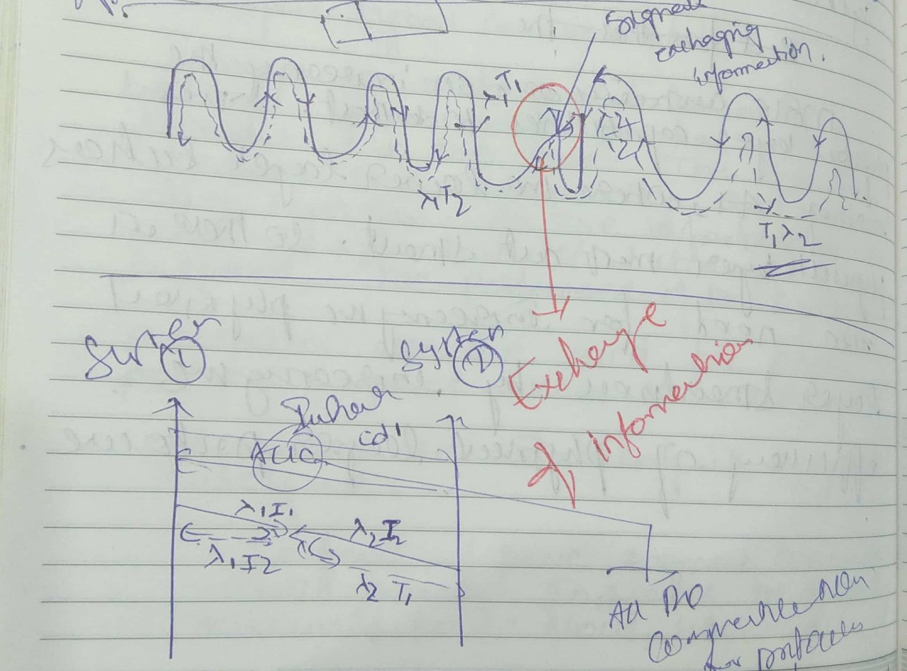

## Free Space Signal Communication

**Breif Concept/Idea.**

**When Signals Communicate in Free Space?** - A free Space Signal COmmunication.

Concept of exchanging the information between the Signal(s) when they interact in free space. 

In general signal(s) travel form Transmitting Node (Tx) to the Receiving Node (Rx), as most of us knows. What if two signals (One Signal from Tx and other Signal form Rx ) interact in the Free-Space and exchange the information in free space rather than processing the information at the systems ends.

This generally reduces the complexity of present day systems. As the information is exchanged/communicated between signals in space(Free Space), system resources can be used for other purpose, such as to analyze the information and to increase its graphical interface. In-fact space signal communication would greatly increases the speed of communication. About `20% - 30%` of time is saved in exchanging/processing the information between two nodes when compared with the existing system.

More over this increases the Physical Layer[PHY] capabilities. This era of AI, where lower layer such as Physical Layer must be smart. So there is also need for increasing the Physical Layer[PHY] smartness by increasing the efficiency of Physical Layer Protocols.

**Frame**: `Encapsulated Unique Key/ID` + `Encapsulated Information` + `Encapsulated Flag Code` .

1. Communication(and Authentication )  Establishment:
    * Tx : Unique Hashing Key is generated.

    * Tx ---> Rx

    * Unique Hashing Key is encoded and encapsulated with Transmitter (Tx) Signal, and Transmitted to the designated Receiver (Rx) with IP System over Secure Channel .
    * Rx ---> Tx

2. During Communication : Exchange of Information.
     *   Both Nodes, Tx and Rx starts transmitting Signals where Signal from Tx has Encoded Information and the Signal from Rx has `Null Information` encoded in empty bits. 

     *   Simply: Tx node signal has `Unique Hashing Key/Id` along with `Some Information` and Rx node Signal with `Unique Hashing Key/ID` with `no` additional information but with `empty bits`, to receive the exchanged information from Tx.

      * Tx `<--->` Free Space `<--->` Rx